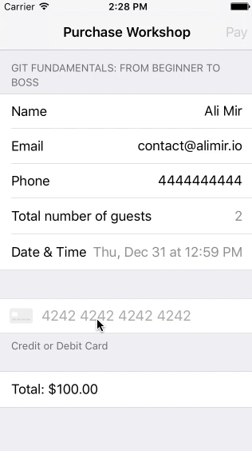

<p align="center">

<a href="https://developer.apple.com/swift"></a>
</p>

## Overview



Made with ❤️ by [Slugbug](https://www.slugbug.co) in Swift.

## Contents
* [Installation](https://github.com/alimir1/Eureka-StripeRow/blob/master/README.md#installation)
* [Introduction](https://github.com/alimir1/Eureka-StripeRow/blob/master/README.md#introduction)
* [Usage](https://github.com/alimir1/Eureka-StripeRow/blob/master/README.md#usage)
* [Requirements](https://github.com/alimir1/Eureka-StripeRow/blob/master/README.md#requirements)
* [Examples](https://github.com/alimir1/Eureka-StripeRow/blob/master/README.md#examples)

## Installation
1. [Install Stripe](https://github.com/stripe/stripe-ios)
2. [Install Eureka](https://github.com/xmartlabs/Eureka)
2. Add "StripeRow.swift" to your project

## Introduction
```StripeRow``` is a custom row for [Eureka](https://github.com/xmartlabs/Eureka) in which the user will be able to input a credit card, its expiration date and the CVV/CVC value via Stripe's [STPPaymentCardTextField](https://stripe.github.io/stripe-ios/docs/Classes/STPPaymentCardTextField.html).
It was created for [Slugbug's](https://www.slugbug.co) iOS app.

## Usage

```swift
import Eureka
import Stripe

class ViewController: FormViewController {
    
    var paymentField = STPPaymentCardTextField()
    
    override func viewDidLoad() {
        form +++
            Section(footer: "Credit or Debit Card")
            <<< StripeRow().cellUpdate { cell, row in
                self.paymentField = cell.paymentField
                self.payBarButton.isEnabled = self.isValidForm()
        }
    }
}
```

## Requirements
* iOS 8.0+
* Xcode 8.3+

## Examples
Follow these steps to run Example project:
* Clone Eureka-StripeRow repository
* Open EurekaStripeRowExample workspace
* Run the Example project.

## Author
* [Ali Mir](http://www.alimir.io) (Founder, [Slugbug](https://www.slugbug.co))

